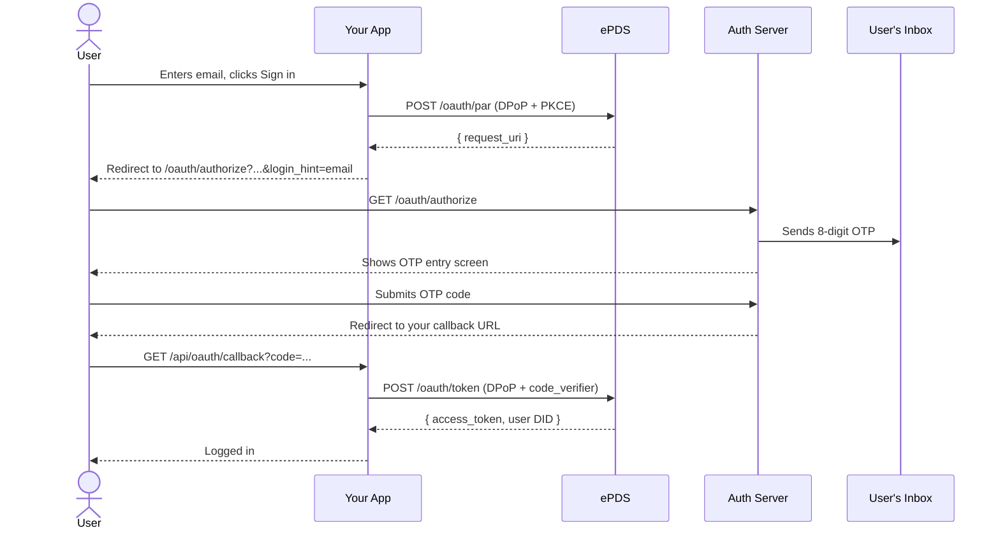
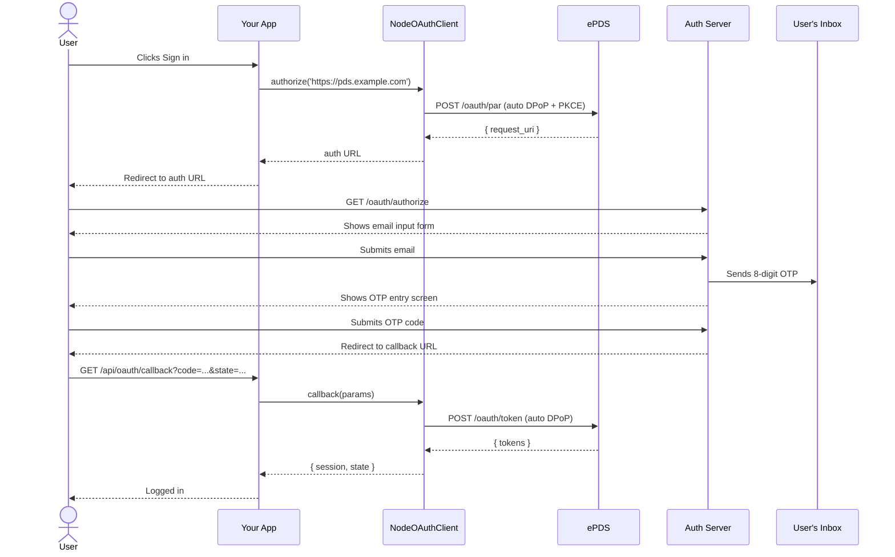

# Flow Walkthroughs

## Which flow should I use?

| Flow | App provides       | User experience                 | Implementation       |
| ---- | ------------------ | ------------------------------- | -------------------- |
| 1    | Email address      | OTP screen immediately          | Hand-rolled PAR/DPoP |
| 2    | Nothing            | Auth server shows email form    | `NodeOAuthClient`    |
| 3    | AT Protocol handle | Auth server resolves, sends OTP | `NodeOAuthClient`    |
| 4    | DID                | Auth server resolves, sends OTP | `NodeOAuthClient`    |

**Flow 1** is the only flow that requires hand-rolled PAR and DPoP code.
`@atproto/oauth-client-node`'s `authorize()` method explicitly omits
`login_hint` from its options — the library resolves handles and DIDs
itself and overrides the hint. Since Flow 1 needs to pass a raw email
as `login_hint` on the auth redirect URL (not in the PAR body), it
cannot use the library.

**Flows 2–4** should use `NodeOAuthClient`, which handles PAR, PKCE,
DPoP, nonce retry, token exchange, and session management automatically.

All four flows end the same way: the user enters an OTP, ePDS redirects
back to your app, and your callback receives an authorization code to
exchange for tokens.

---

## Flows 2–4 — Using `NodeOAuthClient`

### Setup

See the [SKILL.md quick start](../SKILL.md) for `NodeOAuthClient`
construction (client metadata, keyset, stores).

### Login handler

```typescript
// Flow 2: no identifier — auth server shows email form
const authUrl = await client.authorize('https://pds.example.com')

// Flow 3: pass a handle — auth server resolves and sends OTP
const authUrl = await client.authorize('alice.pds.example.com')

// Flow 4: pass a DID
const authUrl = await client.authorize('did:plc:abc123...')
```

The `authorize()` method:

1. Resolves the input (handle → DID → PDS endpoint, or uses the PDS URL directly)
2. Sends a PAR request with PKCE and DPoP (including nonce retry)
3. Stores the OAuth state in your `stateStore`
4. Returns the authorization URL to redirect the user to

Redirect the user's browser to the returned URL.

### Callback handler

```typescript
// GET /api/oauth/callback?code=...&state=...&iss=...
const { session, state } = await client.callback(
  new URLSearchParams(callbackQueryString),
)

const userDid = session.did // e.g. "did:plc:abc123..."
// session.fetchHandler() returns an authenticated fetch for AT Protocol API calls
```

The `callback()` method:

1. Validates the state against your `stateStore`
2. Exchanges the authorization code for tokens (with DPoP)
3. Stores the session in your `sessionStore`
4. Returns the `OAuthSession` and original state

### Restoring a session

```typescript
const session = await client.restore(userDid)
// Use session.fetchHandler() for API calls
// session.signOut() to end the session
```

### Step-by-step (Flow 2 example)

1. User clicks "Sign in" in your app
2. Your login handler calls `client.authorize('https://pds.example.com')`
3. Library sends PAR request, gets `request_uri`, stores state
4. Your app redirects browser to the returned auth URL
5. Auth server shows email form
6. User enters email, receives OTP, enters it
7. **New users only**: ePDS shows a handle picker
8. Auth server redirects to your `redirect_uri` with `?code=&state=&iss=`
9. Your callback calls `client.callback(params)` — library handles token exchange
10. User is logged in

Flows 3 and 4 are identical except the user skips the email form (the
auth server resolves the handle/DID to an email and sends the OTP
directly).

---

## Flow 1 — Hand-rolled (email `login_hint`)

Flow 1 requires hand-rolled PAR and token exchange because the library
cannot pass a raw email as `login_hint`.

### Step-by-step

1. User enters their email in your app and clicks "Sign in"
2. Your login handler:

   a. Generates a DPoP key pair and PKCE verifier (see [dpop-pkce.md](dpop-pkce.md))

   b. POSTs to `/oauth/par` (with DPoP nonce retry)

   c. Stores DPoP private key, code verifier, and state in a signed session cookie

   d. Redirects the browser to `/oauth/authorize?...&login_hint=<email>`

3. The auth server sees the email, immediately sends the OTP, and shows the
   code entry screen (no email form shown)
4. User reads OTP from email and submits it
5. Auth server verifies the code
6. **New users only**: ePDS shows a handle picker
7. ePDS redirects back to your app's callback URL
8. Your callback handler exchanges the code for tokens (with DPoP nonce retry)
9. User is logged in

### Login handler code

```typescript
import {
  generateDpopKeyPair,
  generateCodeVerifier,
  generateCodeChallenge,
  generateState,
  createDpopProof,
} from './auth-helpers'

const PAR_ENDPOINT = 'https://pds.example.com/oauth/par'
const AUTH_ENDPOINT = 'https://auth.pds.example.com/oauth/authorize'
const CLIENT_ID = 'https://yourapp.example.com/client-metadata.json'
const REDIRECT_URI = 'https://yourapp.example.com/api/oauth/callback'

export async function handleLogin(email: string) {
  const { privateKey, publicJwk, privateJwk } = generateDpopKeyPair()
  const codeVerifier = generateCodeVerifier()
  const codeChallenge = generateCodeChallenge(codeVerifier)
  const state = generateState()

  const parBody = new URLSearchParams({
    client_id: CLIENT_ID,
    redirect_uri: REDIRECT_URI,
    response_type: 'code',
    scope: 'atproto transition:generic',
    state,
    code_challenge: codeChallenge,
    code_challenge_method: 'S256',
  })

  // ePDS always requires a nonce on the first attempt — retry automatically
  const makeProof = (nonce?: string) =>
    createDpopProof({
      privateKey,
      jwk: publicJwk,
      method: 'POST',
      url: PAR_ENDPOINT,
      nonce,
    })

  let parRes = await fetch(PAR_ENDPOINT, {
    method: 'POST',
    headers: {
      'Content-Type': 'application/x-www-form-urlencoded',
      DPoP: makeProof(),
    },
    body: parBody.toString(),
  })
  if (!parRes.ok) {
    const nonce = parRes.headers.get('dpop-nonce')
    if (nonce && parRes.status === 400) {
      parRes = await fetch(PAR_ENDPOINT, {
        method: 'POST',
        headers: {
          'Content-Type': 'application/x-www-form-urlencoded',
          DPoP: makeProof(nonce),
        },
        body: parBody.toString(),
      })
    }
  }
  if (!parRes.ok) throw new Error(`PAR failed: ${parRes.status}`)
  const { request_uri } = await parRes.json()

  // Save session data in a signed cookie for the callback
  setSessionCookie({ state, codeVerifier, dpopPrivateJwk: privateJwk })

  // Redirect user to auth server — include login_hint so OTP screen shows immediately
  const authUrl = new URL(AUTH_ENDPOINT)
  authUrl.searchParams.set('client_id', CLIENT_ID)
  authUrl.searchParams.set('request_uri', request_uri)
  authUrl.searchParams.set('login_hint', email)
  return redirect(authUrl.toString())
}
```

### Callback handler code

```typescript
import { restoreDpopKeyPair, createDpopProof } from './auth-helpers'

const TOKEN_ENDPOINT = 'https://pds.example.com/oauth/token'

export async function handleCallback(params: { code: string; state: string }) {
  const session = getSessionFromCookie()
  if (params.state !== session.state) throw new Error('state mismatch')

  const { privateKey, publicJwk } = restoreDpopKeyPair(session.dpopPrivateJwk)

  const tokenBody = new URLSearchParams({
    grant_type: 'authorization_code',
    code: params.code,
    redirect_uri: REDIRECT_URI,
    client_id: CLIENT_ID,
    code_verifier: session.codeVerifier,
  })

  const makeProof = (nonce?: string) =>
    createDpopProof({
      privateKey,
      jwk: publicJwk,
      method: 'POST',
      url: TOKEN_ENDPOINT,
      nonce,
    })

  let tokenRes = await fetch(TOKEN_ENDPOINT, {
    method: 'POST',
    headers: {
      'Content-Type': 'application/x-www-form-urlencoded',
      DPoP: makeProof(),
    },
    body: tokenBody.toString(),
  })
  if (!tokenRes.ok) {
    const nonce = tokenRes.headers.get('dpop-nonce')
    if (nonce) {
      tokenRes = await fetch(TOKEN_ENDPOINT, {
        method: 'POST',
        headers: {
          'Content-Type': 'application/x-www-form-urlencoded',
          DPoP: makeProof(nonce),
        },
        body: tokenBody.toString(),
      })
    }
  }
  if (!tokenRes.ok) throw new Error(`Token exchange failed: ${tokenRes.status}`)

  const { access_token, sub: userDid } = await tokenRes.json()

  // userDid is e.g. "did:plc:abc123..." — resolve to handle via PLC directory
  const plcRes = await fetch(`https://plc.directory/${userDid}`)
  const { alsoKnownAs } = await plcRes.json()
  const handle = alsoKnownAs
    ?.find((u: string) => u.startsWith('at://'))
    ?.replace('at://', '')

  // Store access_token and userDid in your session — user is now logged in
}
```

---

## Sequence diagrams

### Flow 1 — App passes email as `login_hint`



### Flow 2 — Auth server collects email (via `NodeOAuthClient`)



### Flows 3/4 — Handle or DID (via `NodeOAuthClient`)

Same as Flow 2 except:

- `authorize('alice.pds.example.com')` or `authorize('did:plc:abc123...')`
- Library resolves the identity to the user's PDS
- Auth server skips the email form and sends OTP directly
