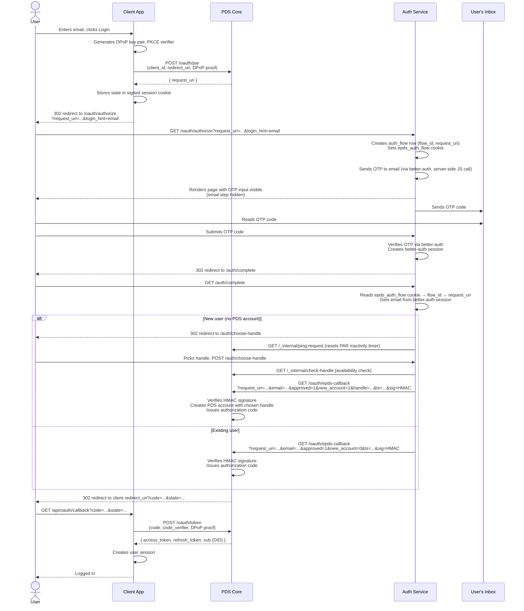
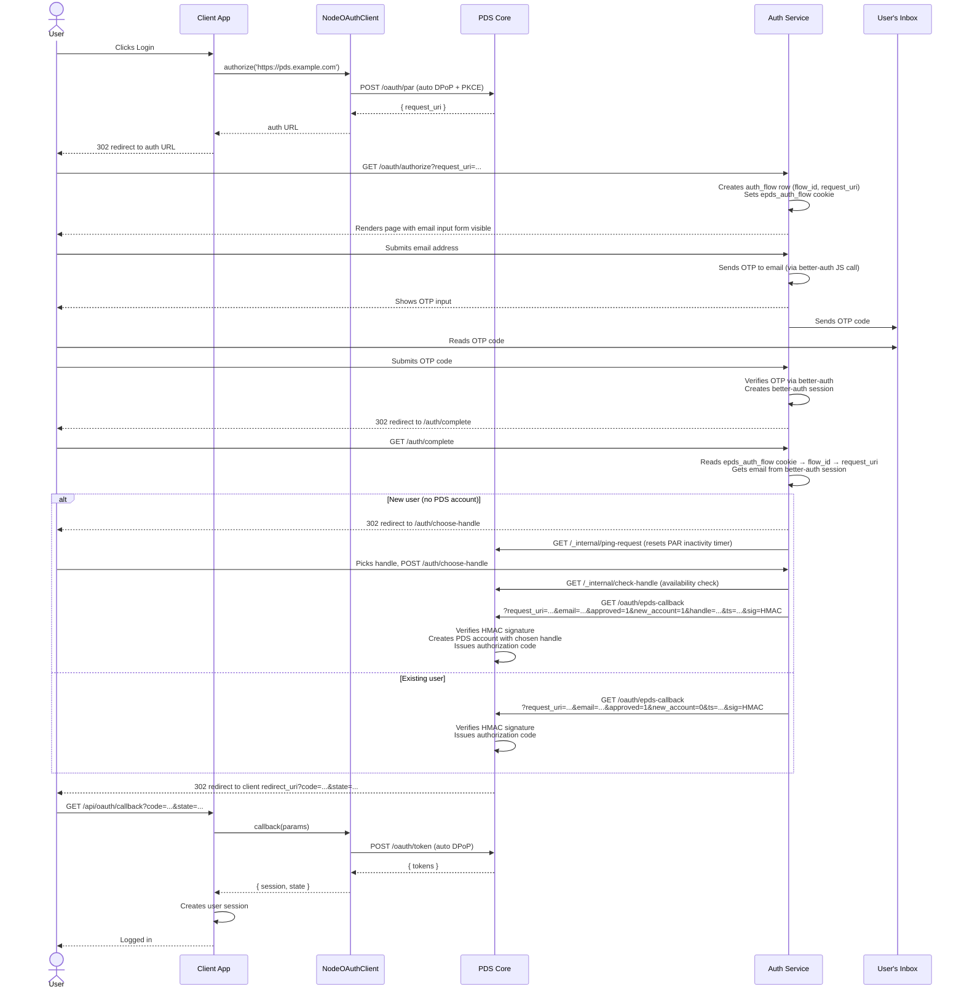

# Login Flows & Integration Guide

## Overview

ePDS lets users log in with their email address. There are no passwords — the
user receives a one-time code by email and enters it to authenticate. Your app
sends the user to ePDS, the user authenticates there, and ePDS sends them back
to your app with a token you can use to make API calls on their behalf.

## Login Flows

There are two integration flows:

| Flow | App provides            | User experience              | Implementation                             |
| ---- | ----------------------- | ---------------------------- | ------------------------------------------ |
| 1    | Email address           | OTP screen immediately       | Hand-rolled PAR/DPoP                       |
| 2    | Nothing, handle, or DID | Depends on input (see below) | `@atproto/oauth-client-node` (recommended) |

**Flow 2** uses `@atproto/oauth-client-node`, which handles PAR, PKCE,
DPoP, nonce retry, and token exchange automatically. **Flow 1** requires
hand-rolled code because the library's `authorize()` method does not
support passing a raw email as `login_hint`.

Both flows end the same way: the user enters their code, ePDS redirects
back to your app, and your app exchanges that redirect for a token.

## Flow 1 — App has its own email form

1. User enters email in your app and clicks "Sign in" — or your app
   already knows the user's handle or DID from a previous session (see
   [Identifying the user](#identifying-the-user))
2. Your login handler registers the login attempt with ePDS (passing the
   identifier as `login_hint`)
3. Your app redirects the user's browser to the ePDS auth page (with the
   same `login_hint`)
4. ePDS immediately sends the OTP and shows the code-entry screen
5. User reads the code from their email and submits it
6. ePDS verifies the code
7. **New users only**: ePDS shows a handle picker — user chooses their handle
8. ePDS redirects back to your app's callback URL
9. Your callback handler exchanges the redirect for an access token
10. User is logged in

## Flow 2 — App has a simple login button

Flow 2 covers three input variants — all use the same code path:

1. User clicks "Sign in" in your app (or your app already knows their handle/DID)
2. Your login handler calls `client.authorize(input)` where `input` is:
   - The PDS URL (no identifier — auth server shows its own email form)
   - A handle like `alice.pds.example.com` (auth server resolves it, sends OTP directly)
   - A DID like `did:plc:abc123...` (same as handle)
3. Library sends PAR request, stores state, returns auth URL
4. Your app redirects the user's browser to the auth URL
5. ePDS collects email if needed, sends the OTP, shows the code-entry screen
6. User reads the code from their email and submits it
7. ePDS verifies the code
8. **New users only**: ePDS shows a handle picker — user chooses their handle
9. ePDS redirects back to your app's callback URL
10. Your callback calls `client.callback(params)` — library handles token exchange
11. User is logged in

## Sequence Diagrams

### Flow 1 — App has its own email form



### Flow 2 — App has a simple login button (via `NodeOAuthClient`)



## Integration Reference

### Register your app

Before users can log in, you need to tell ePDS about your app. You do this by
hosting a small JSON file at a public HTTPS URL — this URL also acts as your
app's identifier. ePDS fetches this file to verify your app is legitimate and
to find your callback URL.

The file must be served with `Content-Type: application/json`:

```json
{
  "client_id": "https://yourapp.example.com/client-metadata.json",
  "client_name": "Your App Name",
  "client_uri": "https://yourapp.example.com",
  "logo_uri": "https://yourapp.example.com/logo.png",
  "redirect_uris": ["https://yourapp.example.com/api/oauth/callback"],
  "scope": "atproto transition:generic",
  "grant_types": ["authorization_code", "refresh_token"],
  "response_types": ["code"],
  "token_endpoint_auth_method": "private_key_jwt",
  "token_endpoint_auth_signing_alg": "ES256",
  "jwks_uri": "https://yourapp.example.com/jwks.json",
  "dpop_bound_access_tokens": true
}
```

The fields from `scope` onward are fixed values required by the AT
Protocol — copy them as-is. The only things you need to change are
`client_id`, `client_name`, `client_uri`, `logo_uri`, and `redirect_uris`
(plus the key fields described below).

#### Confidential vs public clients

The example above uses `"token_endpoint_auth_method": "private_key_jwt"`,
which makes your app a **confidential client**. This is the recommended
setting for any app users will sign in to more than once, because the PDS
remembers consent — returning users skip the consent screen.

The alternative is `"token_endpoint_auth_method": "none"` (a **public
client**), which is simpler (no key management, no JWKS, no
`token_endpoint_auth_signing_alg`) but forces a consent screen on every
login. This is a deliberate AT Protocol security property for clients that
cannot prove their identity. Use `"none"` only for local development or
apps where per-login consent is acceptable.

For confidential clients, you must provide the public half of your ES256
signing key. There are two mutually exclusive ways to do this:

- **`jwks_uri`** — a URL that serves a `{"keys": [...]}` document. Easier
  to rotate keys (update the endpoint, no metadata redeploy).
- **`jwks`** — an inline `{"keys": [...]}` object embedded directly in
  the client metadata JSON. Simpler setup (no extra endpoint), but key
  rotation requires redeploying the metadata file.

Generate a key pair using the ePDS helper script or `@atproto/jwk-jose`:

```bash
pnpm jwk:generate
# Outputs: {"kty":"EC","crv":"P-256","x":"...","y":"...","d":"...","kid":"..."}
```

Or programmatically:

```typescript
import { JoseKey } from '@atproto/jwk-jose'

const key = await JoseKey.generate(['ES256'])
const privateJwk = key.privateJwk // store securely (env var, secret manager)
```

If using `jwks_uri`, serve the public half at that URL:

```typescript
app.get('/jwks.json', (req, res) => {
  const { d, ...publicJwk } = privateJwk // strip private component
  res.json({ keys: [publicJwk] })
})
```

If using inline `jwks`, embed the public key (without `d`) directly in
your client metadata JSON instead.

#### Optional branding

You can customise the OTP email and login page colours:

```json
{
  "email_template_uri": "https://yourapp.example.com/email-template.html",
  "email_subject_template": "{{code}} — Your {{app_name}} code",
  "brand_color": "#000000",
  "background_color": "#ffffff"
}
```

The email template must be an HTML file containing at minimum a `{{code}}`
placeholder. Supported template variables:

| Variable                              | Description                               |
| ------------------------------------- | ----------------------------------------- |
| `{{code}}`                            | The OTP code (required)                   |
| `{{app_name}}`                        | Value of `client_name` from your metadata |
| `{{logo_uri}}`                        | Value of `logo_uri` from your metadata    |
| `{{#is_new_user}}...{{/is_new_user}}` | Shown only on first sign-up               |
| `{{^is_new_user}}...{{/is_new_user}}` | Shown only on subsequent sign-ins         |

#### Optional: control the handle picker

When a new user signs up through your app, ePDS shows them a handle picker
by default. You can override which variant of the picker is shown by adding
an `epds_handle_mode` field to your client metadata:

```json
{
  "epds_handle_mode": "picker"
}
```

Accepted values (case-sensitive):

| Value                | Behaviour                                                              |
| -------------------- | ---------------------------------------------------------------------- |
| `picker`             | Always show the handle picker. No "generate random" button.            |
| `random`             | Always assign a random handle. No picker shown (pre-0.2.0 behaviour).  |
| `picker-with-random` | Show the picker with a "generate random" button (this is the default). |

The mode is resolved per request with the following precedence — first
match wins:

1. `epds_handle_mode` query parameter on the `/oauth/authorize` URL
2. `epds_handle_mode` field in your client metadata JSON
3. `EPDS_DEFAULT_HANDLE_MODE` environment variable on the auth service
4. Built-in default: `picker-with-random`

If you need to override per request — e.g. for a specific signup
campaign — add `epds_handle_mode=picker` (or any other accepted value) as
an additional query parameter when you build the `/oauth/authorize` URL
in [_Redirecting the user to ePDS_](#redirecting-the-user-to-epds-flow-1) below.
The `/oauth/authorize` URL already carries `client_id` and `request_uri`,
so use `&epds_handle_mode=...`, not `?`. Unknown or invalid values are
silently ignored and fall through to the next source.

#### Optional: skip consent on signup (trusted clients)

If your app is listed in the PDS operator's `PDS_OAUTH_TRUSTED_CLIENTS`
and the operator has enabled `PDS_SIGNUP_ALLOW_CONSENT_SKIP=true`, you
can request that the consent screen be skipped when a new user signs up
through your app. Add this to your client metadata:

```json
{
  "epds_skip_consent_on_signup": true
}
```

All three conditions must be met for the skip to take effect:

1. The PDS has `PDS_SIGNUP_ALLOW_CONSENT_SKIP=true`
2. Your `client_id` is in the PDS's `PDS_OAUTH_TRUSTED_CLIENTS` list
3. Your client metadata includes `"epds_skip_consent_on_signup": true`

The skip only applies to initial sign-up — returning users go through
normal consent handling (which may still be auto-approved if they have
already granted the requested scopes).

### Using `@atproto/oauth-client-node` (recommended for Flow 2)

If your app does **not** need to pass a raw email as `login_hint` (i.e.
you are using Flow 2), the `@atproto/oauth-client-node` library
handles PAR, PKCE, DPoP, nonce retry, and token exchange automatically.
Skip straight to [Setting up NodeOAuthClient](#setting-up-nodeoauthclient).

If your app collects emails and passes them as `login_hint` (Flow 1),
the library cannot help — its `authorize()` method does not support
raw email hints. You need the hand-rolled helpers below.

### Security helpers (Flow 1 only)

ePDS uses two standard security mechanisms to protect the login flow:

- **PKCE** — prevents an attacker who intercepts the final redirect from using
  the code themselves
- **DPoP** — binds the access token to your server so it can't be used by
  anyone who steals it

> **Note:** If you are using `NodeOAuthClient` (Flow 2), the library
> handles both of these internally. The helpers below are only needed for
> Flow 1.

Copy these helper functions (from [packages/demo](../packages/demo)) and
call them as shown in the Flow 1 code examples below:

```typescript
import * as crypto from 'node:crypto'

// PKCE
export function generateCodeVerifier(): string {
  return crypto.randomBytes(32).toString('base64url')
}

export function generateCodeChallenge(verifier: string): string {
  return crypto.createHash('sha256').update(verifier).digest('base64url')
}

// DPoP key pair — generate once per OAuth flow, never reuse across flows
export function generateDpopKeyPair() {
  const { publicKey, privateKey } = crypto.generateKeyPairSync('ec', {
    namedCurve: 'P-256',
  })
  return {
    privateKey,
    publicJwk: publicKey.export({ format: 'jwk' }),
    privateJwk: privateKey.export({ format: 'jwk' }),
  }
}

// Restore a DPoP key pair from a serialized private JWK (e.g. from session)
export function restoreDpopKeyPair(privateJwk: crypto.JsonWebKey) {
  const privateKey = crypto.createPrivateKey({ key: privateJwk, format: 'jwk' })
  const publicKey = crypto.createPublicKey(privateKey)
  return { privateKey, publicJwk: publicKey.export({ format: 'jwk' }) }
}

// Create a DPoP proof JWT
export function createDpopProof(opts: {
  privateKey: crypto.KeyObject
  jwk: object
  method: string
  url: string
  nonce?: string
  accessToken?: string
}): string {
  const header = { alg: 'ES256', typ: 'dpop+jwt', jwk: opts.jwk }
  const payload: Record<string, unknown> = {
    jti: crypto.randomUUID(),
    htm: opts.method,
    htu: opts.url,
    iat: Math.floor(Date.now() / 1000),
  }
  if (opts.nonce) payload.nonce = opts.nonce
  if (opts.accessToken) {
    payload.ath = crypto
      .createHash('sha256')
      .update(opts.accessToken)
      .digest('base64url')
  }

  const headerB64 = Buffer.from(JSON.stringify(header)).toString('base64url')
  const payloadB64 = Buffer.from(JSON.stringify(payload)).toString('base64url')
  const signingInput = `${headerB64}.${payloadB64}`
  const sig = crypto.sign('sha256', Buffer.from(signingInput), opts.privateKey)
  return `${signingInput}.${derToRaw(sig).toString('base64url')}`
}

// Convert DER-encoded ECDSA signature to raw r||s (required for ES256 JWTs)
function derToRaw(der: Buffer): Buffer {
  let offset = 2
  if (der[1]! > 0x80) offset += der[1]! - 0x80
  offset++ // skip 0x02
  const rLen = der[offset++]!
  let r = der.subarray(offset, offset + rLen)
  offset += rLen
  offset++ // skip 0x02
  const sLen = der[offset++]!
  let s = der.subarray(offset, offset + sLen)
  if (r.length > 32) r = r.subarray(r.length - 32)
  if (s.length > 32) s = s.subarray(s.length - 32)
  const raw = Buffer.alloc(64)
  r.copy(raw, 32 - r.length)
  s.copy(raw, 64 - s.length)
  return raw
}
```

### Identifying the user

In Flow 1 your app passes an identifier for the user to ePDS in the
OAuth `login_hint` parameter. ePDS accepts three forms:

| Form   | Example                 | When to use                                                                                       |
| ------ | ----------------------- | ------------------------------------------------------------------------------------------------- |
| Email  | `alice@example.com`     | Your app collects email addresses (e.g. via a sign-in form).                                      |
| Handle | `alice.pds.example.com` | Your app already knows the user's AT Protocol handle (e.g. from a previous session, or a follow). |
| DID    | `did:plc:abc123…`       | Your app stores users by DID and never sees their handle.                                         |

All three behave the same way from the client's perspective: ePDS sends
the OTP to the account's email address and shows the code-entry screen
directly. Handles and DIDs are resolved internally by the auth service.

If the identifier doesn't match any existing account, ePDS falls back to
its own email input form (the same form used in Flow 2), so passing a
stale or unknown handle is safe.

In Flow 2 you either omit `login_hint` entirely (pass the PDS URL to
`client.authorize()`), or pass a handle or DID which the library resolves
automatically.

### Setting up `NodeOAuthClient`

For Flow 2, create a `NodeOAuthClient` instance. The library
handles PAR, PKCE, DPoP, nonce retry, and token exchange internally:

```typescript
import { NodeOAuthClient } from '@atproto/oauth-client-node'
import { JoseKey } from '@atproto/jwk-jose'

const privateJwk = JSON.parse(process.env.OAUTH_PRIVATE_KEY!)

const client = new NodeOAuthClient({
  clientMetadata: {
    client_id: 'https://yourapp.example.com/client-metadata.json',
    client_name: 'Your App',
    redirect_uris: ['https://yourapp.example.com/api/oauth/callback'],
    scope: 'atproto transition:generic',
    grant_types: ['authorization_code', 'refresh_token'],
    response_types: ['code'],
    token_endpoint_auth_method: 'private_key_jwt',
    token_endpoint_auth_signing_alg: 'ES256',
    jwks_uri: 'https://yourapp.example.com/jwks.json',
    dpop_bound_access_tokens: true,
  },
  keyset: [await JoseKey.fromImportable(privateJwk, privateJwk.kid)],

  // Implement these with your database, Redis, or other persistent store
  stateStore: {
    async set(key, value) {
      /* store */
    },
    async get(key) {
      /* retrieve */
    },
    async del(key) {
      /* delete */
    },
  },
  sessionStore: {
    async set(key, value) {
      /* store */
    },
    async get(key) {
      /* retrieve */
    },
    async del(key) {
      /* delete */
    },
  },
})
```

Serve the library's endpoints so ePDS can fetch your client metadata and
JWKS:

```typescript
app.get('/client-metadata.json', (req, res) => res.json(client.clientMetadata))
app.get('/jwks.json', (req, res) => res.json(client.jwks))
```

#### Login handler (Flow 2)

```typescript
// No identifier — auth server shows email form
const authUrl = await client.authorize('https://pds.example.com')

// With a handle — auth server resolves and sends OTP
const authUrl = await client.authorize('alice.pds.example.com')

// With a DID — same behaviour as handle
const authUrl = await client.authorize('did:plc:abc123...')

// Redirect the user's browser to authUrl
```

#### Callback handler (Flow 2)

```typescript
const { session, state } = await client.callback(
  new URLSearchParams(callbackQueryString),
)

const userDid = session.did // e.g. "did:plc:abc123..."
// Use session.fetchHandler() for authenticated AT Protocol API calls
```

#### Restoring a session

```typescript
const session = await client.restore(userDid)
// session.fetchHandler() — authenticated fetch
// session.signOut() — end the session
```

### Login handler — registering the login attempt (Flow 1)

> **Flow 2:** Skip this section — `NodeOAuthClient.authorize()` handles
> PAR, DPoP, and nonce retry internally. See
> [Setting up NodeOAuthClient](#setting-up-nodeoauthclient) above.

Your login handler calls ePDS's `/oauth/par` endpoint to register the login
attempt. ePDS returns a short-lived token (`request_uri`) that identifies this
specific login attempt. You then redirect the user to the auth page with that
token.

ePDS always rejects the first call with a security challenge — your code
must catch that and retry with the challenge value included. The code below
handles this automatically:

```typescript
const parBody = new URLSearchParams({
  client_id: clientId,
  redirect_uri: redirectUri,
  response_type: 'code',
  scope: 'atproto transition:generic',
  state,
  code_challenge: codeChallenge,
  code_challenge_method: 'S256',
  // Flow 1 only — omit for Flow 2.
  // May be an email, an AT Protocol handle, or a DID — see above.
  login_hint: identifier,
})

// First attempt (will get a 400 with dpop-nonce)
let parRes = await fetch(parEndpoint, {
  method: 'POST',
  headers: {
    'Content-Type': 'application/x-www-form-urlencoded',
    DPoP: dpopProof,
  },
  body: parBody.toString(),
})

// Retry with nonce if required
if (!parRes.ok) {
  const dpopNonce = parRes.headers.get('dpop-nonce')
  if (dpopNonce && parRes.status === 400) {
    dpopProof = createDpopProof({
      privateKey,
      jwk: publicJwk,
      method: 'POST',
      url: parEndpoint,
      nonce: dpopNonce,
    })
    parRes = await fetch(parEndpoint, {
      method: 'POST',
      headers: {
        'Content-Type': 'application/x-www-form-urlencoded',
        DPoP: dpopProof,
      },
      body: parBody.toString(),
    })
  }
}

const { request_uri } = await parRes.json()
```

### Redirecting the user to ePDS (Flow 1)

> **Flow 2:** Skip this section — `NodeOAuthClient.authorize()` returns
> the redirect URL directly.

After registering the login attempt, redirect the user's browser to the ePDS
auth page. Include the `login_hint` so ePDS skips its own email form and
goes straight to OTP entry. The identifier may be an email, an AT Protocol
handle, or a DID — see [Identifying the user](#identifying-the-user):

```typescript
const authUrl = `${authEndpoint}?client_id=${encodeURIComponent(clientId)}&request_uri=${encodeURIComponent(request_uri)}&login_hint=${encodeURIComponent(identifier)}`
```

Store the DPoP private key, `codeVerifier`, and `state` in a signed HttpOnly
session cookie so the callback handler can retrieve them:

```typescript
// Before redirecting, save OAuth state in a signed cookie
response.cookies.set('oauth_session', signedSessionCookie, {
  httpOnly: true,
  secure: true,
  sameSite: 'lax',
  maxAge: 600, // 10 minutes — matches PAR request_uri lifetime
  path: '/',
})
```

### Callback handler — exchanging the redirect for a token (Flow 1)

> **Flow 2:** Skip this section — `client.callback()` handles token
> exchange internally. See
> [Setting up NodeOAuthClient](#setting-up-nodeoauthclient) above.

After the user authenticates, ePDS redirects them back to your callback URL
with a short-lived code. Your callback handler checks it's a genuine redirect
from this login attempt (by verifying the `state` value you stored earlier),
then exchanges the code for an access token:

```typescript
// Verify state matches what we stored
if (params.state !== sessionData.state) throw new Error('state mismatch')

const { privateKey, publicJwk } = restoreDpopKeyPair(sessionData.dpopPrivateJwk)

const tokenBody = new URLSearchParams({
  grant_type: 'authorization_code',
  code: params.code,
  redirect_uri: redirectUri,
  client_id: clientId,
  code_verifier: sessionData.codeVerifier,
})

// First attempt
let dpopProof = createDpopProof({
  privateKey,
  jwk: publicJwk,
  method: 'POST',
  url: tokenEndpoint,
})
let tokenRes = await fetch(tokenEndpoint, {
  method: 'POST',
  headers: {
    'Content-Type': 'application/x-www-form-urlencoded',
    DPoP: dpopProof,
  },
  body: tokenBody.toString(),
})

// Retry with nonce if required
if (!tokenRes.ok) {
  const dpopNonce = tokenRes.headers.get('dpop-nonce')
  if (dpopNonce) {
    dpopProof = createDpopProof({
      privateKey,
      jwk: publicJwk,
      method: 'POST',
      url: tokenEndpoint,
      nonce: dpopNonce,
    })
    tokenRes = await fetch(tokenEndpoint, {
      method: 'POST',
      headers: {
        'Content-Type': 'application/x-www-form-urlencoded',
        DPoP: dpopProof,
      },
      body: tokenBody.toString(),
    })
  }
}

const { access_token, sub: userDid } = await tokenRes.json()
```

The `sub` field in the token response is the user's AT Protocol identity
(a DID, e.g. `did:plc:abc123...`). You can resolve it to a human-readable
handle via the PLC directory:

```typescript
const plcRes = await fetch(`https://plc.directory/${userDid}`)
const { alsoKnownAs } = await plcRes.json()
const handle = alsoKnownAs
  ?.find((u: string) => u.startsWith('at://'))
  ?.replace('at://', '')
// e.g. "alice.pds.example.com"
```

### User handles

New users choose their handle during signup (e.g. `alice.pds.example.com`).
The local part must be 5–20 characters, alphanumeric with hyphens, no dots.
Real-time availability checking is shown in the handle picker UI.
Handles are not derived from the user's email address, for privacy.
Users can change their handle later via account settings.

## Why does the user have to leave my app at all? (Flow 1)

Even in Flow 1, where your app already has the email, the user still has to
be briefly redirected to the ePDS auth page. This is a requirement of the
AT Protocol:

- The final authentication step (verifying the OTP) must happen on ePDS's
  domain, not your app's domain
- Future authentication methods (passkeys, WebAuthn) need to be bound to ePDS's
  origin — your app's origin won't work for those
